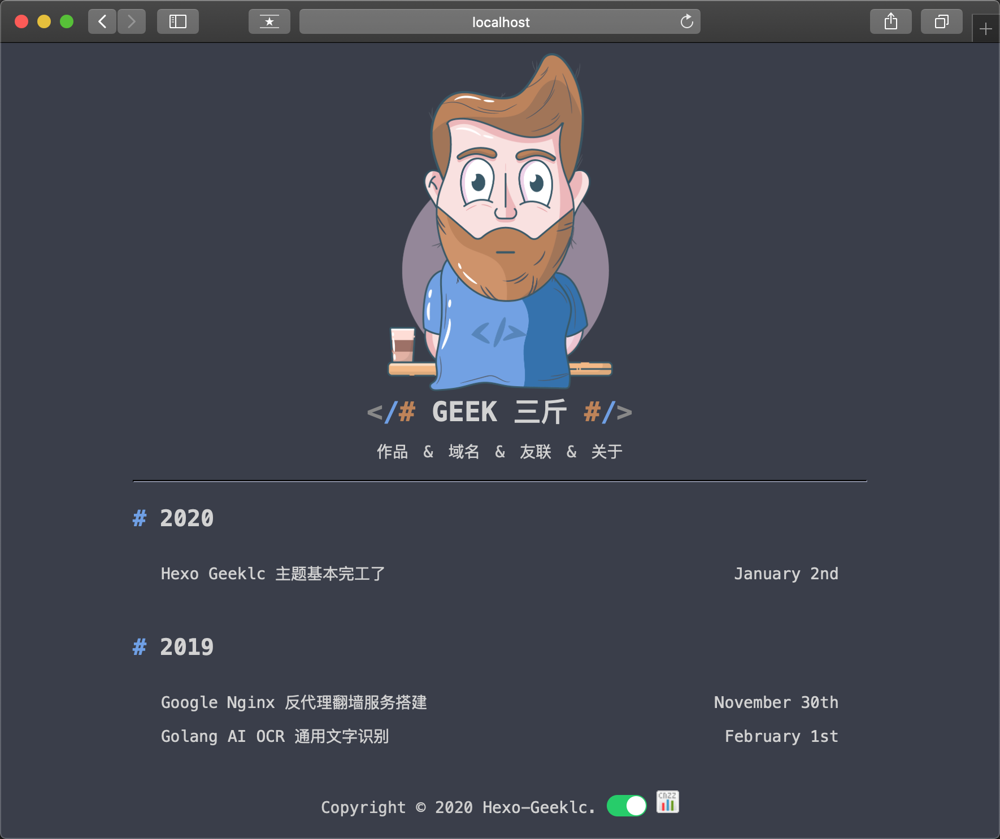
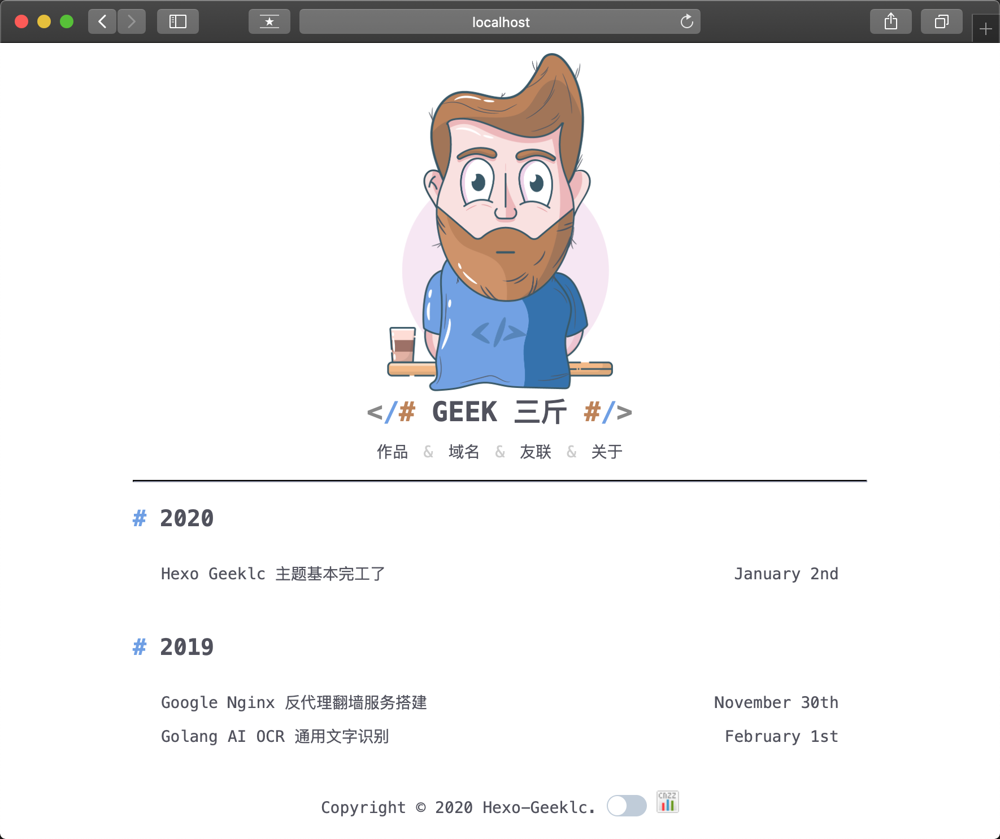

**一款十分简洁的 Hexo 博客 Geek 主题**

## 演示

> 演示地址：https://geek.lc

### 黑色风格



### 白色风格



## 为什么要自己开发

- 因为一直在用 `WordPress`，服务器奔溃，数据丢失了
- 从此不想用笨重的程序了，所以采用纯静态博客，最后选择了 **`Hexo`**
- 找了目前市面上的主题，没有我喜欢的简洁主题，于是亲自操刀(瞎折腾)搞了这款主题
- 主题命名就是博客的域名 ：**`Geek`**

## 使用说明


### 1.下载

进入 **Hexo** -> **themes** 目录下

命令下执行：

```
 git clone https://github.com/sanjinhub/hexo-theme-geek.git geek 
```

or 

进入 **Hexo** -> **themes** 目录下，下载主题解压到当前文件夹下，改名为 **geek**


### 2.修改主题

修改 **hexo** -> **_config.yml** 的 **theme** 为 **geek**

### 3.配置主题

```
# 首页博客名称
logo_title: GEEK 三斤

# 默认主题风格 black or white
style: black

# 主题 ico
favicon: /favicon.ico

# 主题菜单
# 需要新建页面：hexo new page "页面地址"
menu:
  作品: /project
  域名: /domain
  友联: /links
  关于: /about
  Github: https://github.com/sanjinhub

# valine 评论 , 使用说明见 https://valine.js.org
# 做了域名限制，请改成自己的 KEY
valine:
  appId: CmCti21ooOOIzFOhEyFkFvR0-gzGzoHsz
  appKey: FqiyUqbg7McKN2eG0MCewupf

# 关闭 Hexo 自带代码高亮
highlight:
  enable: false
```

## 贡献者

> 感谢所有这些优秀的贡献者们

<table>
  <tr>
    <td align="center"><a target="_bank" href="https://github.com/sanjinhub">
      
      <div><sub><b>SanJin</b></sub><div></a></td>
    <td align="center"><a target="_bank" href="https://github.com/li-xunhuan"><div><sub><b>李寻欢</b></sub><div></a></td>
  </tr>
</table>